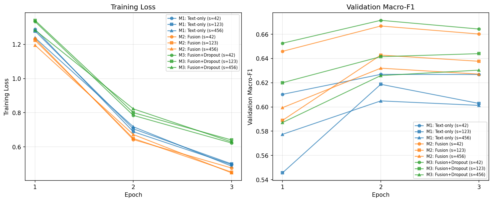
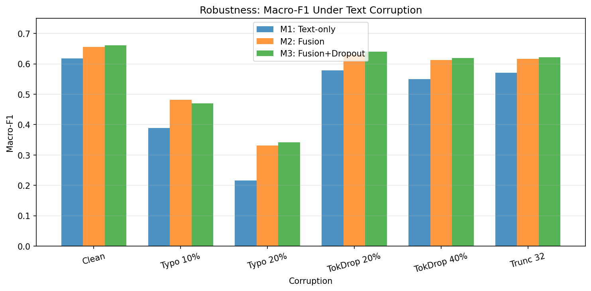
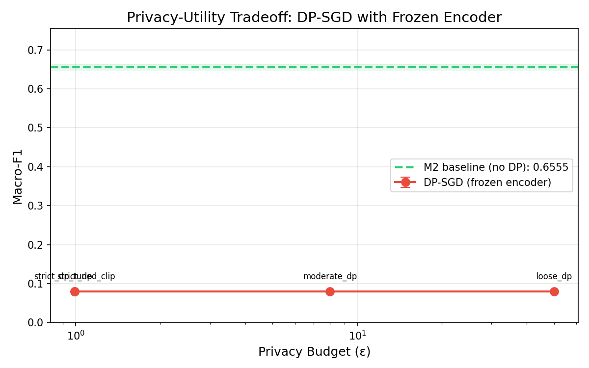
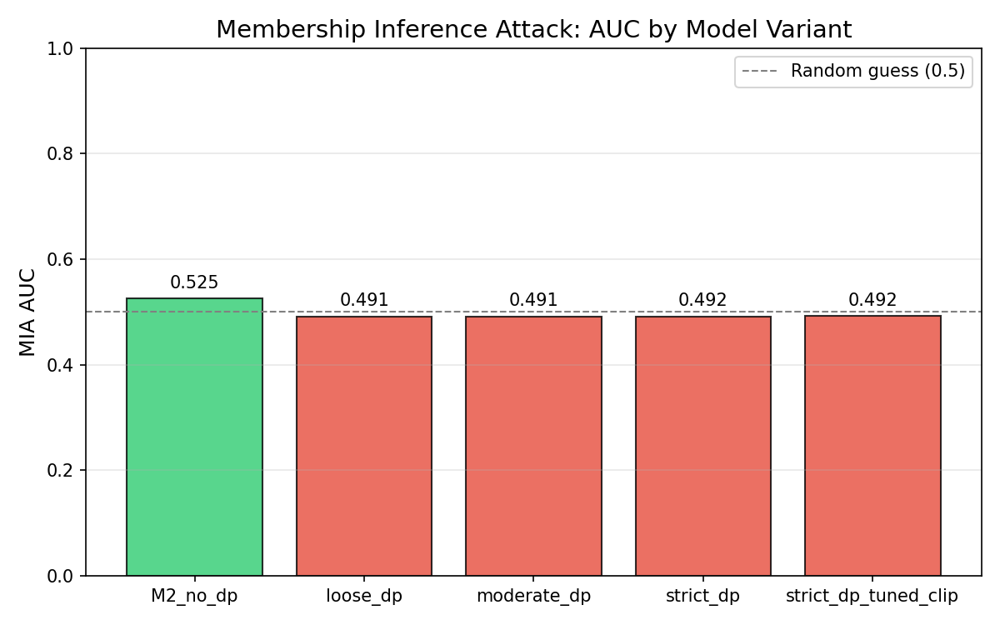

# finetune-bench

[](https://github.com/tyy0811/finetune-bench/actions/workflows/test.yml)

Multimodal classification benchmark where the headline fusion gain turned out to be entity memorization — and the ablation proved it.

`58 tests` | `5 ablation variants` | `8 corruption conditions` | `fp16 mixed-precision` | `DP-SGD privacy` | `MIA evaluation` | `model card` | `Docker` | `ONNX export` | `CI green`

See [agent-bench](https://github.com/tyy0811/agent-bench) for agentic RAG and retrieval evaluation evidence.

## Key Results

> 20K-sample random split, 3 epochs, evaluated on held-out test set (n=2000).

### Ablation Table 1 -- Component Contribution

| Variant | Macro-F1 | Accuracy | Per-class F1 range | Delta vs B1 |
|---------|----------|----------|-------------------|-------------|
| B1: TF-IDF + LogReg | 0.6037 | 0.8230 | 0.26--0.91 | -- |
| B2: Tabular-only LightGBM | 0.4636 | 0.7880 | 0.00--0.92 | -0.1401 |
| M1: DistilBERT text-only | 0.6236 +/- 0.0047 | 0.8247 +/- 0.0116 | 0.33--0.92 | +0.0199 |
| M2: Full fusion | 0.6555 +/- 0.0076 | 0.8642 +/- 0.0056 | 0.38--0.95 | +0.0518 |
| M3: Fusion + dropout | 0.6605 +/- 0.0053 | 0.8660 +/- 0.0047 | 0.41--0.94 | +0.0568 |

*DL variants report mean +/- std over 3 seeds (42, 123, 456).*

### Ablation Table 2 -- Robustness Under Corruption

| Corruption | Rate | M1: Text-only | M2: Fusion | M3: Fusion+Dropout | Delta (M3 vs M1) |
|------------|------|---------------|------------|-------------------|-------------------|
| None (clean) | -- | 0.6177 | 0.6560 | 0.6611 | +0.0434 |
| Typo injection | 10% | 0.3892 | 0.4813 | 0.4701 | +0.0809 |
| Typo injection | 20% | 0.2157 | 0.3316 | 0.3420 | +0.1263 |
| Token dropout | 20% | 0.5780 | 0.6312 | 0.6400 | +0.0620 |
| Token dropout | 40% | 0.5499 | 0.6121 | 0.6194 | +0.0695 |
| Truncation | 32 tokens | 0.5703 | 0.6165 | 0.6213 | +0.0510 |
| Tabular dropout | 50% | N/A | 0.6023 | 0.6139 | -- |
| Full tabular ablation | -- | N/A | 0.5516 | 0.5672 | -- |

> **The most important finding isn't in these tables:** the +3.2pp fusion gain disappears when company features are removed (Finding #7), revealing that the architecture works but the CFPB-specific gain is entity memorization, not generalizable multimodal learning.

### Findings

1. **Fusion outperforms single-modality.** Adding tabular features to DistilBERT (M1 -> M2) yields a +3.2pp macro-F1 gain and +4.0pp accuracy gain, confirming that company metadata and submission channel carry signal beyond what narrative text provides.

2. **Modality dropout provides marginal but consistent improvement.** M3 edges out M2 by +0.5pp F1 on clean data and shows stronger robustness across all corruption types, supporting the regularization hypothesis.

3. **Typo injection is the most damaging corruption.** At 20% rate, M1 drops from 0.62 to 0.22 F1 (--65%). Fusion models degrade less severely (M3: 0.66 -> 0.34, --48%), indicating tabular features act as a fallback when text is corrupted.

4. **Token dropout is well-tolerated.** Even at 40% token dropout, M3 retains 0.62 F1 (--6% relative), suggesting the model does not depend on specific token positions.

5. **Tabular features are load-bearing for fusion models.** Full tabular ablation drops M2 by --10.4pp and M3 by --9.4pp, showing the fusion head relies on metadata signal rather than learning to ignore it.

6. **Tabular-only baseline (B2) is the weakest.** LightGBM achieves only 0.46 F1, confirming that narrative text is the primary information source for product classification. B2 fails completely on Payday loan (F1=0.00) where the product label depends on narrative context rather than company or submission metadata.

7. **Fusion gain is driven by company identity.** M2b (fusion without `company` and `company_complaint_volume`) achieves 0.6189 F1 — below M1's 0.6236. The +3.2pp fusion gain from Finding #1 does not survive removal of company features, indicating the architecture works but the CFPB-specific gain is largely entity memorization. State and submission channel alone do not add signal beyond text.

8. **Temporal drift is mild.** Under a time-based split (train: pre-2023, test: post-2023), M2 achieves 0.6471 F1 (vs 0.6555 on random split, -0.8pp). This small degradation suggests the model generalizes across time reasonably well, though the test distribution may share enough company patterns with training to mask larger drift.

### Training Curves



*M3 (green) converges slower in loss due to modality dropout noise but reaches the highest validation F1.*

### Robustness Comparison



## Architecture

```
Text Branch              Tabular Branch
DistilBERT               Feature eng. + MLP
(fine-tuned)             (2 layers)
    |                        |
[CLS] embed (768)       tabular embed (64)
    |                        |
    |   Modality Dropout     |
    |   (M3: exclusive,      |
    |    p=0.1/branch)       |
    |                        |
    +--------+---------------+
             |
        Fusion Head
    concat -> FC(832,256)
    -> ReLU -> Dropout
    -> FC(256, num_classes)
             |
      Product category
```

## Quick Start

```bash
# Install
pip install -e ".[dev]"

# Download data
python scripts/download_data.py

# Run all experiments
python scripts/run_all_experiments.py

# Or with Docker
docker compose up test          # Run tests
docker compose up train-smoke   # Quick smoke run
docker compose up train-full    # Full ablation matrix
```

## Dataset

[CFPB Consumer Complaints](https://www.consumerfinance.gov/data-research/consumer-complaints/). All tabular features are available at the time the complaint is submitted. No post-outcome features are used.

The `DatasetAdapter` pattern makes the pipeline dataset-agnostic -- implementing `adapters/your_dataset.py` is all that's needed to benchmark a new domain.

**Note:** The CFPB database is not a statistical sample of all consumer experiences. Narratives are published only when consumers opt in.

<details>
<summary>Product category merge map (21 raw → 10 canonical)</summary>

The CFPB has renamed product categories over time (e.g., "Credit card" became "Credit card or prepaid card"). The adapter merges historically-renamed categories into canonical classes before applying the rare-class consolidation threshold (`MIN_CLASS_SIZE=500`):

| Canonical class | Merged raw categories |
|----------------|----------------------|
| Credit reporting | Credit reporting, Credit reporting credit repair services..., Credit reporting or other personal consumer reports |
| Credit card | Credit card, Credit card or prepaid card, Prepaid card |
| Payday loan | Payday loan, Payday loan title loan or personal loan, Payday loan title loan personal loan or advance loan, Consumer Loan |
| Money transfer | Money transfer virtual currency or money service, Money transfers, Virtual currency |
| Bank account | Bank account or service, Checking or savings account |
| Debt collection | Debt collection, Debt or credit management |
| Mortgage | *(unchanged)* |
| Student loan | *(unchanged)* |
| Vehicle loan or lease | *(unchanged)* |
| Other | Remaining categories below 500 narratives |

The merge map is defined in `adapters/cfpb.py:_PRODUCT_MERGE_MAP`.

</details>

<details>
<summary>Training details</summary>

Custom PyTorch loop (`training/train.py`) with:

- AdamW + linear warmup + cosine decay
- Differential learning rates (2e-5 encoder, 1e-3 new layers)
- Gradient accumulation (effective batch 32) and clipping (max_norm=1.0)
- Modality dropout (M3 variant: 10% per branch, mutually exclusive)
- Early stopping on validation macro-F1 (patience=2)
- MLflow experiment tracking
- Inverse-frequency class weights for imbalanced data

</details>

<details>
<summary>Robustness corruption types</summary>

Five corruption types evaluate model degradation:

| Type | Description |
|------|-------------|
| Typo injection | Random char swap/delete/insert at 10% and 20% rates |
| Token dropout | Replace tokens with [PAD] and zero attention_mask at 20% and 40% rates |
| Truncation | Keep only first 32 whitespace tokens |
| Tabular dropout | Zero 50% of features independently |
| Tabular ablation | Zero all tabular features |

</details>

<details>
<summary>ONNX deployment latency</summary>

| Format | Precision | Latency (single) | Latency (batch=32) | Model size |
|--------|-----------|-------------------|--------------------|------------|
| PyTorch | fp32 | 191.18 ms | 5344.49 ms | ~267 MB |
| ONNX | fp32 | 30.24 ms | 724.33 ms | 266.6 MB |
| ONNX | fp16 | 39.62 ms | 905.27 ms | 133.3 MB |

*CPU inference on Modal A10G instance (CPU path). ONNX fp32 provides 6.3x single-sample speedup. fp16 ONNX halves model size (267 -> 133 MB) but is slightly slower than fp32 on CPU due to fp16->fp32 cast overhead; fp16 latency advantages require GPU inference with Tensor Core support.*

</details>

## GPU Profiling & Mixed Precision

Training supports automatic mixed precision (fp16) via `torch.cuda.amp`, with GPU memory profiling logged to MLflow.

**Enable fp16 training:**

```bash
python training/train.py --variant M2 --use-amp

# Or run the full experiment matrix with fp16
python scripts/run_all_experiments.py --use-amp
```

**GPU profiling** is automatic on CUDA: every training run logs peak memory, mean allocation, GPU name, and per-epoch timing to MLflow under the `gpu/` namespace. View with:

```bash
mlflow ui  # Navigate to gpu/ metrics
```

**GPU profiling sample** (from M2 fp32, seed 42 on Modal A10G):

| Metric | Value |
|--------|-------|
| GPU | NVIDIA A10 (24 GB VRAM) |
| Peak allocated | 1950 MB (8.2% utilization) |
| Mean allocated | 1095 MB |
| Epoch time | 70.7s |
| Total training time | 212.0s (3 epochs) |

**fp32 vs fp16 comparison (Modal A10G, 24 GB):**

```bash
modal run scripts/modal_run.py --amp
```

Runs 4 configs (M2/M3 x fp32/fp16) x 3 seeds = 12 runs. Results saved to `results/amp_comparison.json`.

| Variant | Precision | Macro-F1 | Peak GPU (MB) | Epoch Time (s) | Speedup |
|---------|-----------|----------|---------------|-----------------|---------|
| M2      | fp32      | 0.6562   | 1951          | 70.9            | --      |
| M2      | fp16      | 0.6570   | 1797          | 36.2            | 2.0x    |
| M3      | fp32      | 0.6619   | 1952          | 66.5            | --      |
| M3      | fp16      | 0.6598   | 1797          | 34.4            | 1.9x    |

*NVIDIA A10 (24 GB VRAM), 3 seeds each. DistilBERT (66M params) shows ~2x epoch speedup from fp16 Tensor Core acceleration, with only 8% peak memory reduction — the model is too small for dramatic memory savings. F1 is preserved within noise. See [DECISIONS.md](DECISIONS.md) for design rationale.*

## Privacy & Model Governance

DP-SGD training, membership inference evaluation, data privacy audit, and model card generation — demonstrating responsible AI practices in the fine-tuning lifecycle.

### Privacy-Utility Tradeoff



| Config | Target ε | Actual ε | Macro-F1 |
|--------|----------|----------|----------|
| M2 baseline (no DP) | ∞ | — | 0.6555 +/- 0.0076 |
| Loose DP | 50.0 | 49.99 | 0.0801 |
| Moderate DP | 8.0 | 8.00 | 0.0801 |
| Strict DP | 1.0 | 0.99 | 0.0801 |

*DP-SGD with frozen DistilBERT encoder (Opacus 1.4 limitation — see [DECISIONS.md](DECISIONS.md) #13). Only the tabular MLP + fusion head (66K params) are trained with differential privacy. The frozen encoder prevents the model from adapting text representations, collapsing utility. This is an honest limitation of applying DP to transformer architectures with current tooling.*

### Membership Inference Attack



| Model | ε | MIA AUC | Loss Gap | Interpretation |
|-------|---|---------|----------|----------------|
| M2 (no DP) | ∞ | 0.5253 | +0.13 | Slight memorization |
| Loose DP | 50.0 | 0.4913 | -0.08 | Random guess |
| Moderate DP | 8.0 | 0.4914 | -0.07 | Random guess |
| Strict DP | 1.0 | 0.4918 | -0.06 | Random guess |

*Loss-threshold attack on 2000 balanced member/non-member samples. The non-DP model shows AUC slightly above random guess (0.53), consistent with limited memorization on this dataset. DP models show AUC ~0.49, confirming DP-SGD eliminates the memorization signal.*

### Data Privacy Audit

Pre-training audit of the CFPB training corpus (16,000 samples):

- **Redaction markers:** 223,294 (CFPB source-level redaction working)
- **Residual PII:** 7 instances (5 emails, 2 phones) — imperfect source redaction
- **NER entities:** 114,758 (59,799 ORG, 36,527 PERSON, 18,365 GPE)
- **Near-duplicates:** 34,754 pairs (exact normalized)
- **PII gate:** Enforced (`max_residual_pii=0`), exits non-zero when PII detected

### Model Card

Auto-generated from training artifacts following [Mitchell et al. 2019](https://arxiv.org/abs/1810.03993): [artifacts/model_card.md](artifacts/model_card.md)

Covers: Model Details, Intended Use, Training Data, Evaluation Results, Fairness Analysis, Privacy, Limitations & Risks, Deployment Recommendations.

<details>
<summary>Run the privacy pipeline</summary>

```bash
# Data audit (local, ~2 min with NER)
python -m privacy.data_auditor

# DP training on Modal (12 runs, ~20 min)
modal run scripts/modal_privacy.py --dp-train

# Membership inference on Modal (4 runs, ~8 min)
modal run scripts/modal_privacy.py --mia

# Non-DP baseline MIA (1 run, ~15 min)
modal run scripts/modal_privacy.py --baseline-mia

# Generate charts + model card
python scripts/generate_privacy_charts.py
python scripts/generate_model_card.py
```

</details>

## Limitations & Ethics

**Dataset limitations:**
- CFPB narratives are opt-in, not a representative sample
- Class imbalance (Debt collection dominates); mitigated with inverse-frequency class weights and macro-F1
- `company` feature creates shortcut learning risk (company -> product correlation). No-company diagnostic (M2b) confirms fusion gain is dependent on company identity — M2b F1 (0.6189) falls below M1 (0.6236)
- Temporal distribution shift: M2 drops 0.8pp under time-based split (pre/post 2023), consistent with mild drift from evolving complaint patterns

**Model limitations:**
- DistilBERT is English-only; not tested on other languages
- Tabular feature set is CFPB-specific; generalization requires implementing a new adapter
- Not suitable for production deployment without domain-specific validation and fairness auditing

**Leakage safeguards:**
- `company_complaint_volume` computed on training split only, log-transformed and standardized
- `company` shortcut acknowledged; M1 provides shortcut-free baseline; M2b diagnostic confirms fusion gain depends on company identity
- All encoding categories (top-50 companies, states, channels) derived from training data only
